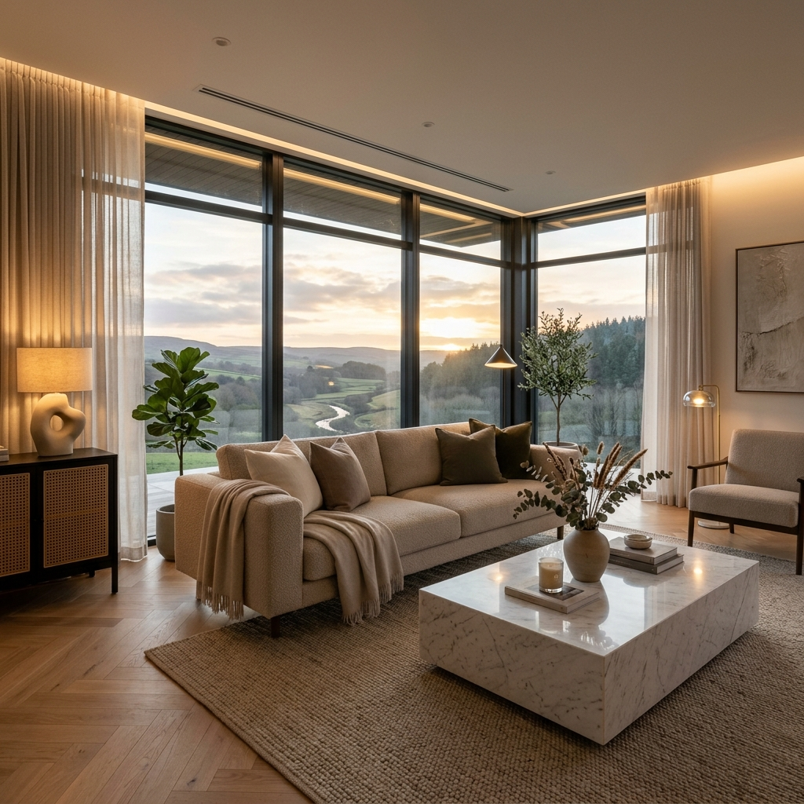
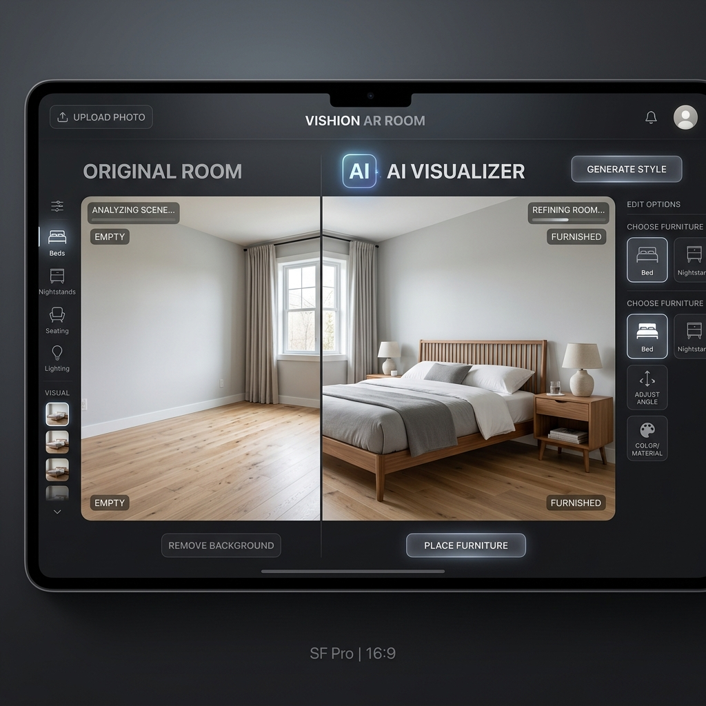

# 🛋️ The Urban Karigar | Premium Furniture E-Commerce



> **Where Dreams Meet Craftsmanship** — A comprehensive, full-stack e-commerce solution for modern furniture, modular kitchens, and bespoke interior design.

---

## ✨ Overview

**The Urban Karigar** is a state-of-the-art digital platform designed to provide a premium shopping and visualization experience. It seamlessly integrates a powerful Django backend with a dynamic React frontend, featuring an AI-powered room visualizer that lets users see their dream furniture in their own space.

---

## 🎨 Key Features

### 🛒 Premium E-Commerce Experience
- **Elegant Product Catalog**: Browse through curated categories like Sofa Sets, Beds, Wardrobes, and more.
- **Dynamic Filtering**: Advanced search and category-based filtering for effortless navigation.
- **Detailed Specifications**: High-resolution galleries and in-depth product details.
- **Cart & Wishlist**: Persistent shopping cart and favorite items management.

### 📐 Specialized Design Services
- **Modular Kitchens**: Explore L-Shape, U-Shape, Island, and Straight kitchen layouts.
- **Interior Portfolio**: A showcase of completed Home, Hotel, and Office design projects.
- **AI Room Visualizer**: (Beta) Visualize furniture in real-world settings using integrated AI background removal.



### 🛠️ Robust Administrative Control
- **Inventory Management**: Full CRUD operations for products, categories, and projects.
- **Order & Payment Tracking**: Centralized dashboard to manage the entire sales lifecycle.
- **Analytics**: Real-time business performance monitoring.
- **Security**: JWT-based authentication and secure payment gateway integrations (Stripe, Razorpay).

---

## 🚀 Tech Stack

### Frontend
- **Framework**: React 19 + Vite
- **Routing**: React Router 7
- **Styling**: Vanilla CSS (Modern, Responsive, Premium UI)
- **State Management**: React Context API
- **API**: Axios

### Backend
- **Framework**: Django 6.0 + Django REST Framework
- **Admin UI**: Django Unfold (Modern Dark-Mode Admin)
- **Authentication**: JWT (SimpleJWT)
- **Database**: PostgreSQL (Production) / SQLite (Dev)
- **Messaging**: Twilio (SMS) & Email Notifications
- **Payments**: Stripe & Razorpay

---

## 🛠️ Getting Started

### 1. Repository Setup
```bash
git clone https://github.com/sanjaysaini16122000-ui/furniture-ecommerce-fullstack.git
cd furniture-ecommerce-fullstack
```

### 2. Backend Configuration
```bash
cd furniture_backend
python -m venv .venv
source .venv/bin/activate  # Windows: .venv\Scripts\activate
pip install -r requirements.txt
# Create .env file with your SECRET_KEY and DB credentials
python manage.py migrate
python manage.py runserver
```

### 3. Frontend Configuration
```bash
cd ../furniture-react
npm install
# Create .env file with VITE_API_BASE_URL=http://localhost:8000/api
npm run dev
```

---

## 📁 Project Architecture

```text
.
├── furniture-react/          # Frontend Application
│   ├── src/
│   │   ├── admin/            # Admin Dashboard
│   │   ├── components/       # Reusable UI
│   │   ├── context/          # State Providers
│   │   ├── pages/            # Page Views
│   │   └── styles/           # Modern UI Tokens
│   └── public/               # Static Assets
│
├── furniture_backend/        # Backend API
│   ├── accounts/             # Auth & Users
│   ├── products/             # Inventory Models
│   ├── orders/               # Sales Logic
│   ├── visualizer/           # AI Logic
│   └── config/               # System Settings
│
└── docs/                     # Documentation Assets
```

---

## 📞 Contact & Support

- **Email**: theurbankarigar@gmail.com
- **Instagram**: [@the.urbankarigar](https://www.instagram.com/the.urbankarigar)
- **Address**: Jagatpura, Jaipur, Rajasthan 302017

---

© 2026 The Urban Karigar. Crafted with passion for modern interiors.
