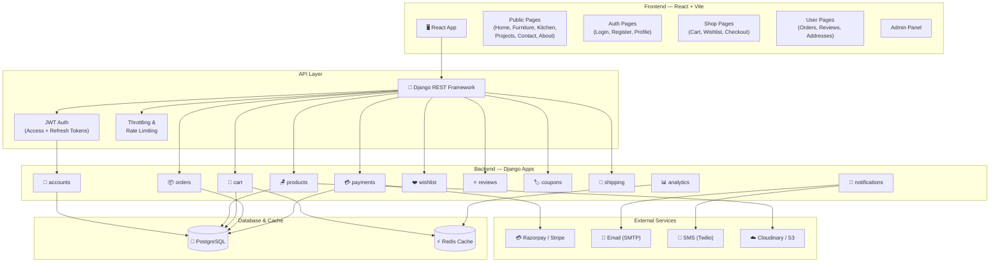
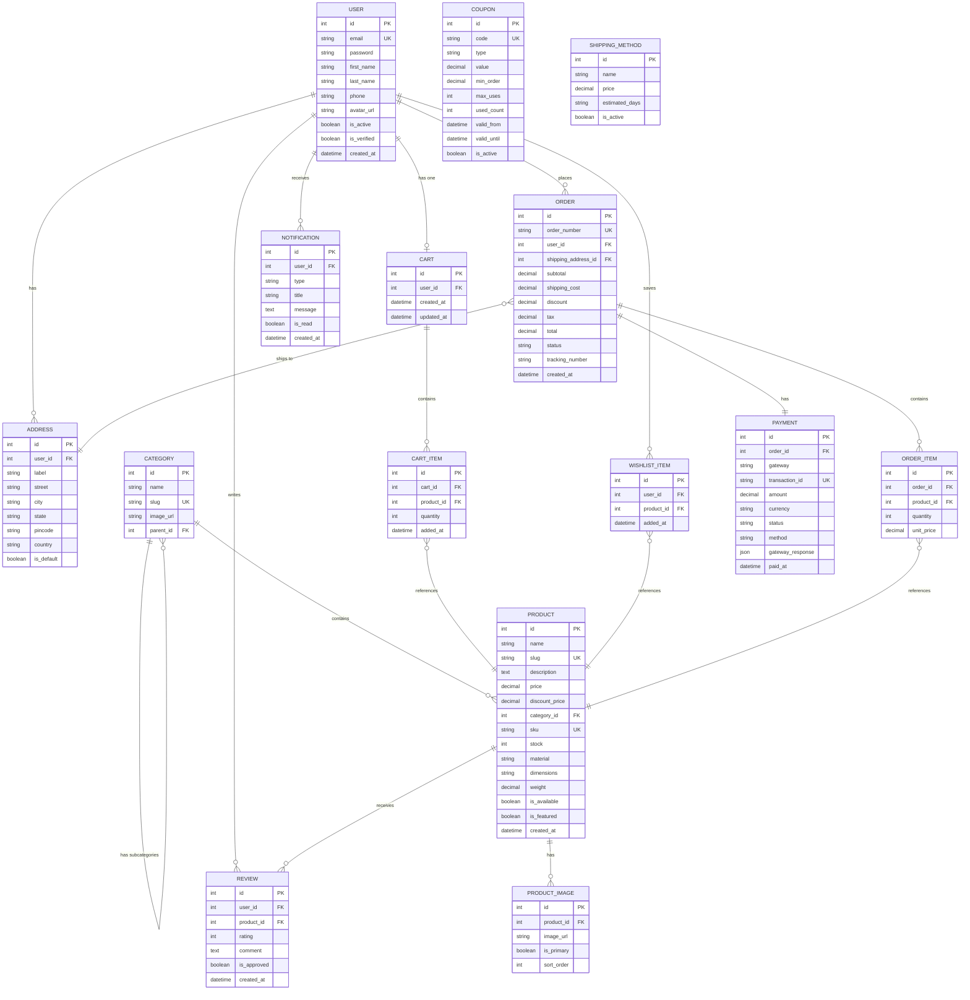
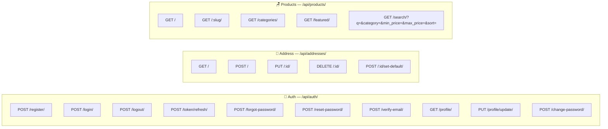
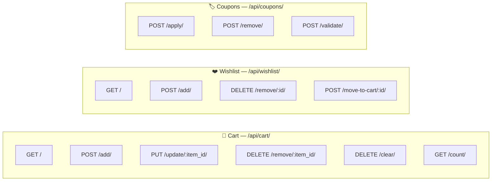
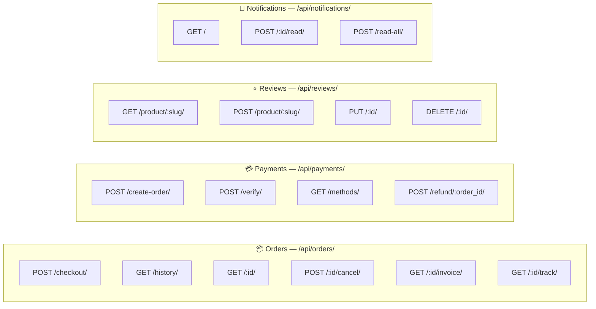
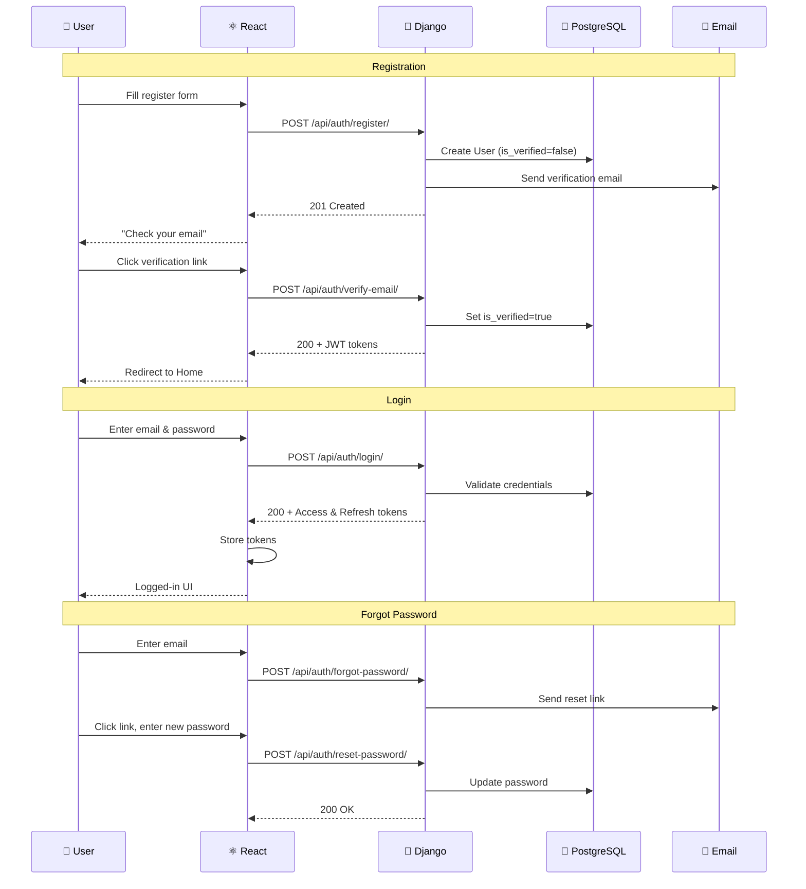
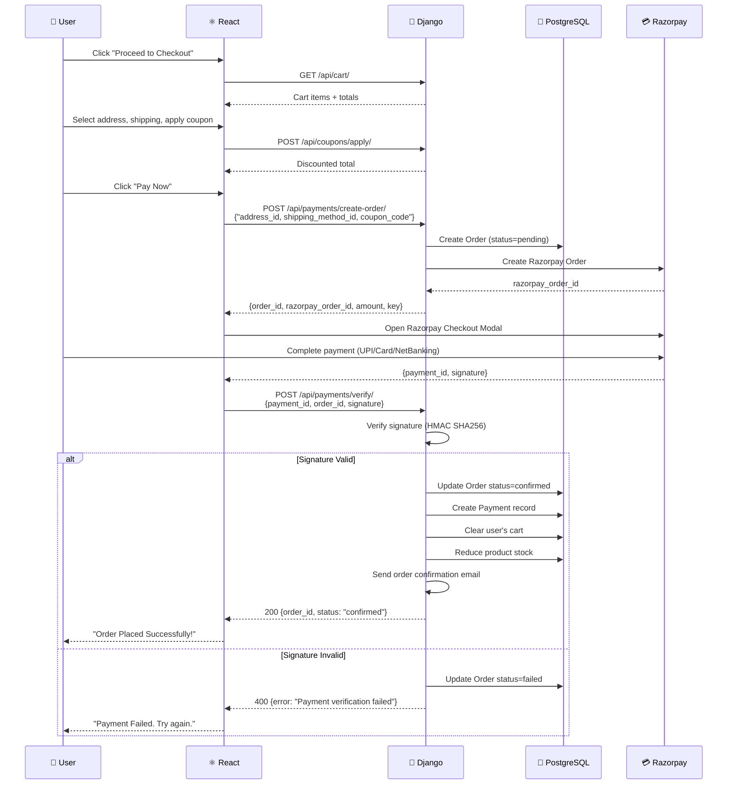
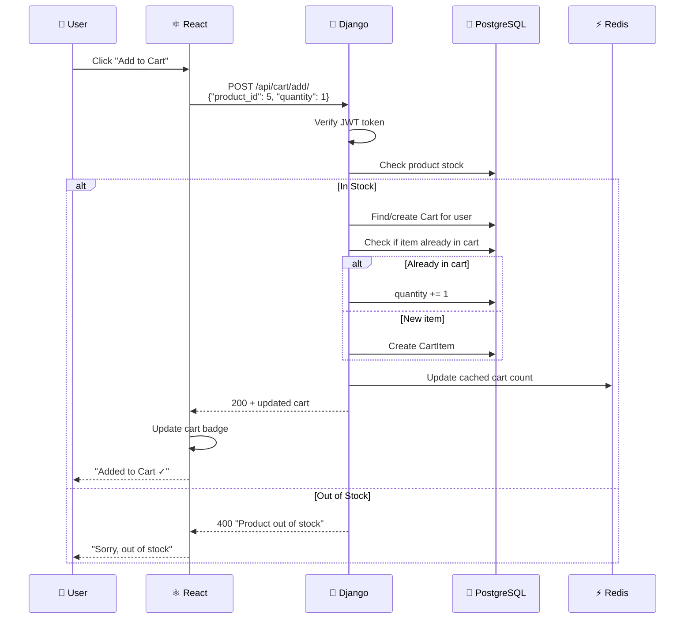
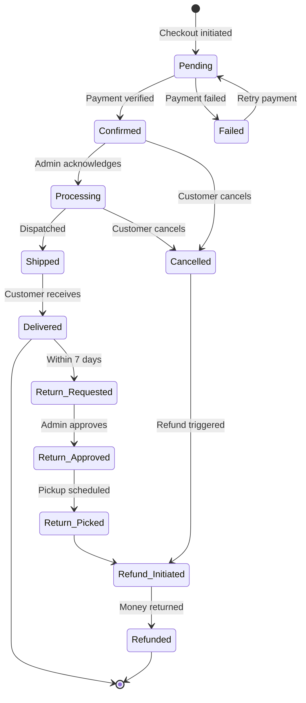

# Django E-commerce Backend — Furniture Website

Complete architecture for a production-ready furniture e-commerce platform with Django backend.

---

## 1. System Overview



---

## 2. Database ER Diagram



---

## 3. All API Endpoints







---

## 4. Authentication Flow



---

## 5. Payment & Checkout Flow (Razorpay)



---

## 6. Add-to-Cart Flow



---

## 7. Order Lifecycle



---

## 8. Django Project Structure

```
furniture-backend/
├── manage.py
├── requirements.txt
├── .env
│
├── config/                      # ⚙️ Project Configuration
│   ├── settings/
│   │   ├── base.py              # Common settings
│   │   ├── development.py       # Dev overrides
│   │   └── production.py        # Prod (Gunicorn, SSL)
│   ├── urls.py                  # Root URL routing
│   ├── celery.py                # Async task queue
│   └── wsgi.py
│
├── accounts/                    # 👤 Authentication & Users
│   ├── models.py                # CustomUser, Address
│   ├── serializers.py           # Register, Login, Profile
│   ├── views.py                 # Auth + Profile APIs
│   ├── urls.py
│   ├── signals.py               # Post-register actions
│   └── utils.py                 # Email helpers
│
├── products/                    # 🪑 Product Catalog
│   ├── models.py                # Product, Category, ProductImage
│   ├── serializers.py           # List, Detail, Search
│   ├── views.py                 # Product APIs + filters
│   ├── urls.py
│   └── filters.py               # django-filter configs
│
├── cart/                        # 🛒 Shopping Cart
│   ├── models.py                # Cart, CartItem
│   ├── serializers.py
│   ├── views.py
│   └── urls.py
│
├── wishlist/                    # ❤️ Wishlist
│   ├── models.py                # WishlistItem
│   ├── serializers.py
│   ├── views.py
│   └── urls.py
│
├── orders/                      # 📦 Order Management
│   ├── models.py                # Order, OrderItem
│   ├── serializers.py
│   ├── views.py
│   ├── urls.py
│   └── utils.py                 # Invoice generation
│
├── payments/                    # 💳 Payment Gateway
│   ├── models.py                # Payment, Refund
│   ├── serializers.py
│   ├── views.py                 # Razorpay/Stripe integration
│   ├── urls.py
│   ├── razorpay_client.py       # Razorpay SDK wrapper
│   └── webhooks.py              # Payment event handlers
│
├── coupons/                     # 🏷️ Discount Coupons
│   ├── models.py                # Coupon, CouponUsage
│   ├── serializers.py
│   ├── views.py
│   └── urls.py
│
├── reviews/                     # ⭐ Product Reviews
│   ├── models.py                # Review
│   ├── serializers.py
│   ├── views.py
│   └── urls.py
│
├── shipping/                    # 🚚 Shipping
│   ├── models.py                # ShippingMethod
│   ├── serializers.py
│   └── views.py
│
├── notifications/               # 📧 Email/SMS Notifications
│   ├── models.py                # Notification
│   ├── tasks.py                 # Celery async tasks
│   ├── templates/               # Email HTML templates
│   │   ├── welcome.html
│   │   ├── order_confirmed.html
│   │   ├── order_shipped.html
│   │   └── password_reset.html
│   └── utils.py                 # Send email/SMS helpers
│
├── analytics/                   # 📊 Dashboard Analytics
│   ├── views.py                 # Sales, users, products stats
│   └── urls.py
│
└── common/                      # 🔧 Shared Utilities
    ├── permissions.py           # IsOwner, IsAdmin
    ├── pagination.py            # Custom paginator
    ├── middleware.py             # Request logging
    └── exceptions.py            # Custom error handlers
```

---

## 9. Frontend New Pages & Components (React)

| Page / Component | Route | Description |
|---|---|---|
| **Login** | `/login` | Email + password login |
| **Register** | `/register` | Sign up with email verification |
| **Profile** | `/profile` | Edit name, phone, avatar |
| **Addresses** | `/profile/addresses` | Manage delivery addresses |
| **Cart** | `/cart` | View/edit cart items |
| **Wishlist** | `/wishlist` | Saved items |
| **Checkout** | `/checkout` | Address → Shipping → Coupon → Pay |
| **Order History** | `/orders` | List of past orders |
| **Order Detail** | `/orders/:id` | Status, items, tracking, invoice |
| **Product Reviews** | (on product page) | Star rating + comment form |

---

## 10. Tech Stack Summary

| Layer | Technology |
|---|---|
| **Frontend** | React + Vite (existing) |
| **API Framework** | Django REST Framework |
| **Authentication** | JWT (simplejwt) |
| **Database** | PostgreSQL |
| **Cache** | Redis |
| **Task Queue** | Celery + Redis |
| **Payment Gateway** | Razorpay (India) / Stripe (International) |
| **File Storage** | Cloudinary / AWS S3 |
| **Email** | Django SMTP / SendGrid |
| **SMS** | Twilio |
| **Search** | django-filter + PostgreSQL Full Text |
| **CORS** | django-cors-headers |
| **Deployment** | Gunicorn + Nginx + Docker |

---

## 11. Key Packages (requirements.txt)

```
Django>=4.2
djangorestframework>=3.14
djangorestframework-simplejwt>=5.3
django-cors-headers>=4.3
django-filter>=23.5
psycopg2-binary>=2.9
python-dotenv>=1.0
Pillow>=10.0
celery>=5.3
redis>=5.0
razorpay>=1.4
stripe>=7.0
cloudinary>=1.36
gunicorn>=21.2
whitenoise>=6.5
```
